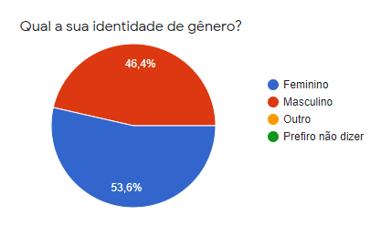
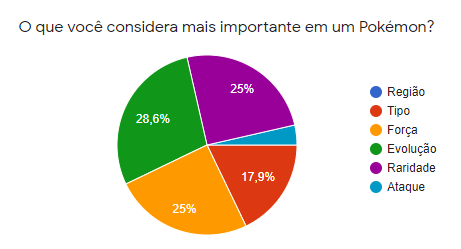
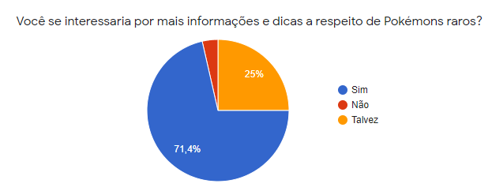
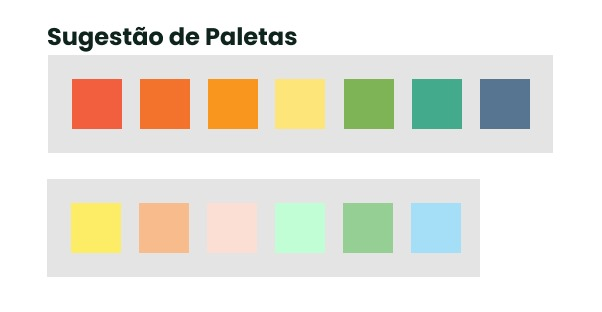

# Data Lovers/PokeSource

INSERIR GIF DE POKEMOM
## Índice

- [1. Sobre o projeto](#1-sobre-o=projeto)
- [2. Pesquisa de usuário](#2-pesquisa-de-usuário)
- [3. Histórias de usuários](#3-histórias-de-usuários)
- [4. Layout e protótipos](#4-layout-e-protótipos)
- [5. Experiência dos usuários](#5-experiência-dos-usuários)
- [6. Objetivos de aprendizagem](#6-objetivos-de-aprendizagem)
- [7. Testes unitários](#7-testes-unitários)
- [8. Autoras](#8-autoras)

---

## 1. Sobre o projeto

Projeto, Data Lovers, realizado no Bootcamp da Laboratória.
Neste projeto construímos uma aplicação web que permite que o usuário visualize, filtre, ordene dados, e além disso, contar com um cálculo agregado que mostra o percentual de acordo com o filtro escolhido. 

### Dados e tema escolhido:

- [Pokémon](src/data/pokemon/pokemon.json): Neste conjunto você encontrará uma lista com os 251 Pokémons da região de Kanto e Johto, com suas respectivas estatísticas utilizadas no jogo [Pokémon GO](http://pokemongolive.com).

Esta aplicação é direcionada a informações pontuais sobre pokemons, para quem tem conhecimento do universo. Constatamos  através de pesquisa que a maioria dos sites tem tuturiais e dicas aos jogadores, porém nada muito direcionado sobre os pokemons. 

O intuíto da aplicação é ajudar na melhoria do desempenho dos usuários como jogadores, conhecendo melhor sobre os pokemons.

## 2. Pesquisa de usuário

Pesquisa de usuário realizada através de form, distribuido para jogadores de Pokemon Go e fãs.

- [Pesquisa com jogadores  e fãs de Pokémon Go ](add link)

Segue abaixo dados da pesquisa:

### Gráfico - Faixa etária

### Gráfico - Identidade de gênero

### Gráfico - Pokémon favorito

### Gráfico - O que é mais importante em um pokémon?

### Gráfico - Mais informações

### Pesquisa Laboratória

- [Pesquisa com jogadores de Pokémon Go disponibilizado pela Laboratória](src/data/pokemon/README.md)

## 3. Histórias de usuários

Após pesquisa, foram definidas as histórias de usuário, um norte para a criação de uma aplicação adequada a necessidade de nossos usuários.

## 4. Layouts e protótipos

### Protótipo de baixa fidelidade

### Protótipo de alta fidelidade

### Paleta de cores

### Projeto final

Inserir gif com o site

## 5. Experiência dos usuários

#### Testes de usabilidade

Durante o projeto, realizamos testes de usabilidade com usuários diferentes, e com base nos resultados desses testes, iteramos desenhos de interface e aplicamos sugestões dos usuários em nossa aplicação. 

### Alterações sugeridas pelos usuários e problemas detectados:

- [ ] Apagar dados de porcentagem de acordo com a mudança do filtro - resolvido;
- [ ] Apagar dados da tela para filtrar novos dados - resolvido;
- [ ] Linkar ordenar com os filtros - resolvido;
- [ ] Deixar as informações de CP destacadas - a resolver futuramente;

## 6. Objetivos de aprendizagem

- [ ] [Uso de HTML semântico.](https://developer.mozilla.org/en-US/docs/Glossary/Semantics#Semantics_in_HTML)
- [ ] Uso de seletores de CSS.
- [ ] Construir sua aplicação respeitando o desenho realizado (protótipo).
- [ ] [Uso de flexbox em CSS.](https://css-tricks.com/snippets/css/a-guide-to-flexbox/)

### DOM e Web APIs

- [ ] Uso de seletores de DOM.
- [ ] Gerenciamento de eventos de DOM.
- [ ] [Manipulação dinâmica de DOM.](https://developer.mozilla.org/pt-BR/docs/DOM/Referencia_do_DOM/Introdu%C3%A7%C3%A3o) (appendChild |createElement | createTextNode| innerHTML | textContent | etc.)

### JavaScript

- [ ] Uso de condicionais (if-else | switch | operador ternário)
- [ ] Uso de laços (for | for..in | for..of | while)
- [ ] Uso de funções (parâmetros | argumentos | valor de retorno)
- [ ] Manipular arrays (filter | map | sort | reduce)
- [ ] Manipular objects (key | value)
- [ ] Uso ES modules ([`import`](https://developer.mozilla.org/en-US/docs/Web/JavaScript/Reference/Statements/import) | [`export`](https://developer.mozilla.org/en-US/docs/Web/JavaScript/Reference/Statements/export))
- [ ] Diferenciar entre expression e statements.
- [ ] Diferenciar entre tipos de dados atômicos e estruturados.

### Testing

- [ ] [Teste unitário.](https://jestjs.io/docs/pt-BR/getting-started)

### Estrutura do código e guia de estilo

- [ ] Organizar e dividir o código em módulos (Modularização)
- [ ] Uso de identificadores descritivos (Nomenclatura | Semântica)
- [ ] Uso de linter (ESLINT)

### Git e GitHub

- [ ] Uso de comandos de git (add | commit | pull | status | push)
- [ ] Gerenciar repositórios de GitHub (clone | fork | gh-pages)
- [ ] Colaboração no Github (branches | pull requests | |tags)

## 7. Testes unitários

Foram escritos testes unitários para que o projeto pudesse rodar adequadamente.
Segue abaixo imagens da cobertura de testes:

INSERIR IMAGEM DA COBERTURA DE TESTE
### Testing

-  [Teste unitário.](https://jestjs.io/docs/pt-BR/getting-started)

## 8. Autoras
### Giuliana

[Github](https://github.com/Giuthamie)
[Linkedin](https://www.linkedin.com/in/giuliana-thami%C3%AA/)
### Liziane

[Github](https://github.com/lizianegarcia)
[Linkedin](https://www.linkedin.com/in/liziane-garcia-da-rosa-44ba8832/)

