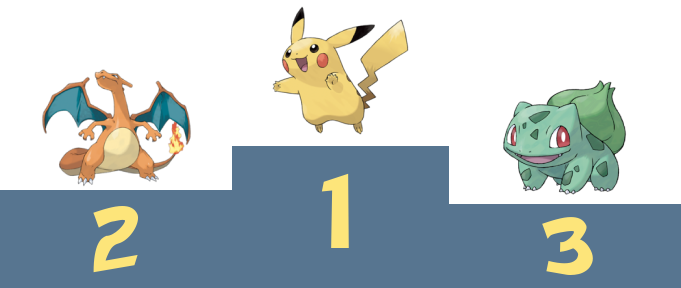
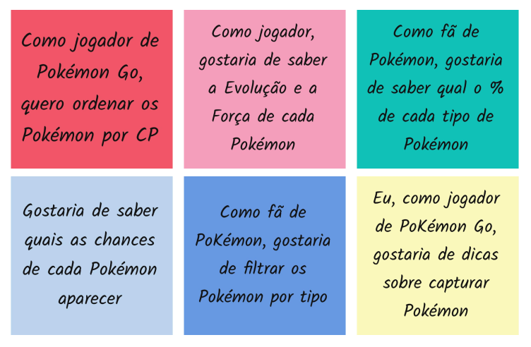
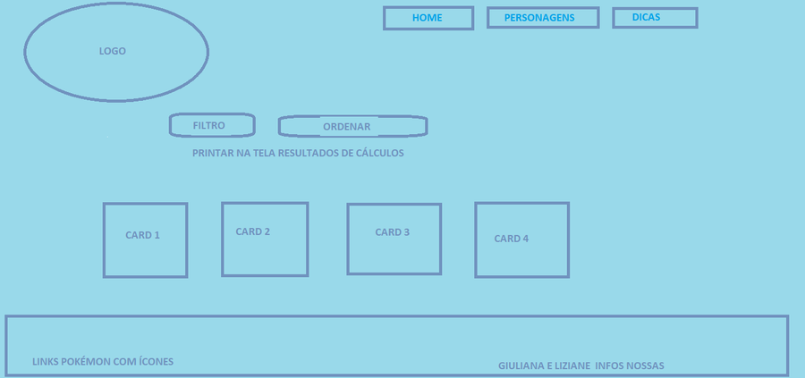
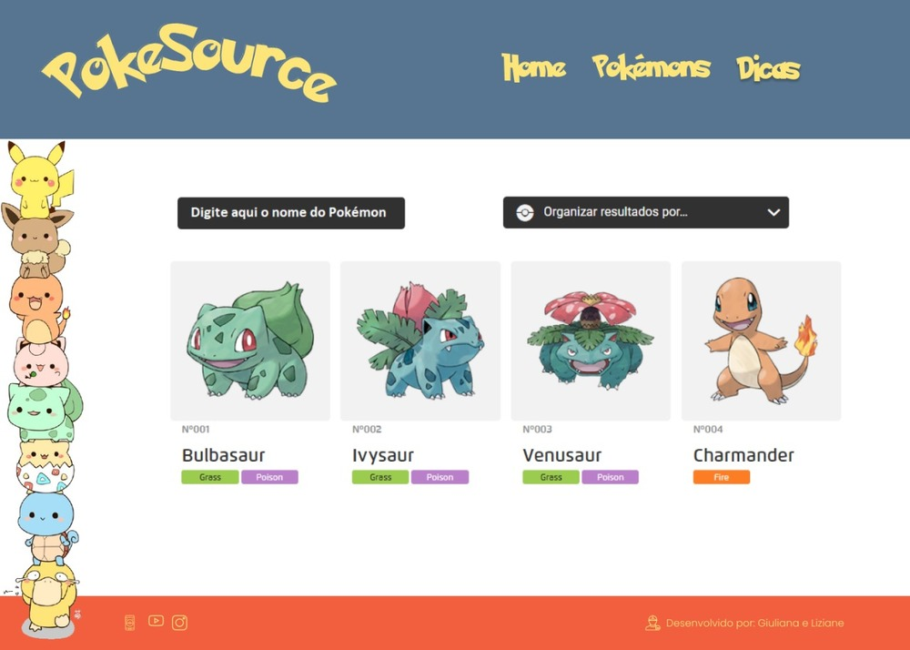
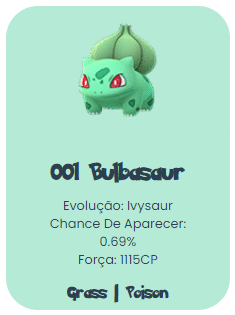
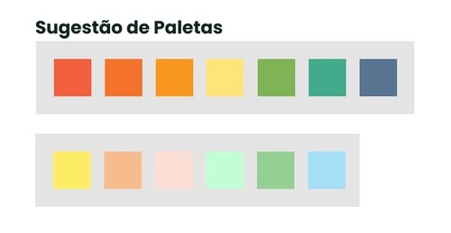

# PokeSource

 

## Índice

- [1. Sobre o projeto](#1-sobre-o-projeto)
- [2. Pesquisa de usuário](#2-pesquisa-de-usuário)
- [3. Histórias de usuários](#3-histórias-de-usuários)
- [4. Layout e protótipos](#4-layout-e-protótipos)
- [5. Experiência dos usuários](#5-experiência-dos-usuários)
- [6. Objetivos de aprendizagem](#6-objetivos-de-aprendizagem)
- [7. Testes unitários](#7-testes-unitários)
- [8. Autoras](#8-autoras)

---

## 1. Sobre o projeto

Pokémon é uma franquia de mídia que pertence a The Pokémon Company, tendo sido criada por Satoshi Tajiri em 1995. Ela é centrada em criaturas ficcionais que os seres humanos capturam e os treinam para lutarem um contra o outro como um esporte.
Neste projeto desenvolvemos uma aplicação web que permite que o usuário visualize, filtre e ordene dados, além de contar também com um cálculo agregado que mostra o percentual de acordo com o filtro escolhido.
Esta aplicação é direcionada a informações pontuais sobre Pokémon, para quem tem conhecimento sobre esse universo. Constatamos que a maioria dos sites tem tutoriais e dicas aos jogadores, porém nada muito direcionado aos Pokémon ou informações pouco esclarecedoras ou desatualizadas.
O intuito da aplicação é ajudar na melhoria do desempenho dos usuários como jogadores, conhecendo melhor sobre Pokémon.

O projeto Data Lovers foi realizado no Bootcamp da Laboratória.

## 2. Pesquisa de usuário

Constatamos através de uma pesquisa, que nossos usuários têm entre 25 a 35 anos, são majoritariamente mulheres e consideram mais relevantes em um Pokémon sua Evolução, Raridade, Força e Tipo, respectivamente.
Desse modo, todas as informações mais relevantes de conteúdo vieram através dos nossos usuários e suas necessidades.
Descobrimos também que o Pikachu é o Pokémon favorito de 25% das pessoas, seguido de Charizard (15%) e Bulbassauro (11%).

## 3. Histórias de usuários

User Story ou “história de usuário” é uma descrição concisa de uma necessidade do usuário do produto (ou seja, de um “requisito”) sob o ponto de vista desse usuário. A User Story busca descrever essa necessidade de uma forma simples e leve.
Após os apurarmos os resultados da pesquisa, foram definidas as histórias de usuários, como um norte para a criação de uma aplicação adequada a necessidade de nossos usuários.

## 4. Layouts e protótipos

Em um primeiro momento, decidimos que teríamos apenas uma página, com os cards dos Pokémon, um filtro para filtrar Pokémon por tipo e um ordenar de A-Z.

### Protótipo de baixa fidelidade

Com o desenvolvimento do projeto, percebemos que precisaríamos de mais duas páginas, uma para ser a Home e outra para as Dicas aos usuários. Além claro, da Pokédex com todos os cards e informações de todos Pokémon.

### Protótipo de alta fidelidade

Para o card, personalizamos todas as principais informações que os usuários escolheram através da pesquisa.

### Paleta de cores

Para o layout, pensamos em algo bem clean, desta forma, desenvolvemos uma paleta com cores que remetem aos tipos de Pokémon, porém sem nenhuma cor muito viva ou muito cansativa aos olhos.

### Projeto final

O usuário tem a opção de filtrar o Pokémon por nome, digitando o nome completo ou apenas parte dele e clicando no botão Filtrar:

Através do filtro por Tipo, o usuário visualizará todos os Pokémon do tipo escolhido, além de saber qual a porcentagem o tipo escolhido representa do total:

Dentre os Pokémon que foram filtrados no passo anterior, é possível ordená-los por CP. Vale lembrar que o ordenar por CP funciona também sem qualquer seleção anterior de filtro.
Ordenação do CP maior ao menor:

Ordenação do CP menor ao maior:

## 5. Experiência dos usuários

#### Testes de usabilidade

Durante o projeto, realizamos testes de usabilidade com diferentes tipos de usuários, e com base nos resultados desses testes, iteramos desenhos de interface e aplicamos sugestões dos usuários em nossa aplicação.

### Alterações sugeridas pelos usuários e problemas detectados:

- [ ] Apagar dados de porcentagem de acordo com a mudança do filtro;
- [ ] Apagar dados da tela para filtrar novos dados;
- [ ] Ordenar os Pokémon por CP ao invés de ordem alfabética;
- [ ] Linkar a ordenação por CP com os resultados do filtro de Tipos.

## 6. Objetivos de aprendizagem

- [ ] [Uso de HTML semântico.](https://developer.mozilla.org/en-US/docs/Glossary/Semantics#Semantics_in_HTML)
- [ ] Uso de seletores de CSS.
- [ ] Construir sua aplicação respeitando o desenho realizado (protótipo).
- [ ] [Uso de flexbox em CSS.](https://css-tricks.com/snippets/css/a-guide-to-flexbox/)

### DOM e Web APIs

- [ ] Uso de seletores de DOM.
- [ ] Gerenciamento de eventos de DOM.
- [ ] [Manipulação dinâmica de DOM.](https://developer.mozilla.org/pt-BR/docs/DOM/Referencia_do_DOM/Introdu%C3%A7%C3%A3o) (appendChild |createElement | createTextNode| innerHTML | textContent | etc.)

### JavaScript

- [ ] Uso de condicionais (if-else | switch | operador ternário)
- [ ] Uso de laços (for | for..in | for..of | while)
- [ ] Uso de funções (parâmetros | argumentos | valor de retorno)
- [ ] Manipular arrays (filter | map | sort | reduce)
- [ ] Manipular objects (key | value)
- [ ] Uso ES modules ([`import`](https://developer.mozilla.org/en-US/docs/Web/JavaScript/Reference/Statements/import) | [`export`](https://developer.mozilla.org/en-US/docs/Web/JavaScript/Reference/Statements/export))
- [ ] Diferenciar entre expression e statements.
- [ ] Diferenciar entre tipos de dados atômicos e estruturados.

### Testing

- [ ] [Teste unitário.](https://jestjs.io/docs/pt-BR/getting-started)

### Estrutura do código e guia de estilo

- [ ] Organizar e dividir o código em módulos (Modularização)
- [ ] Uso de identificadores descritivos (Nomenclatura | Semântica)
- [ ] Uso de linter (ESLINT)

### Git e GitHub

- [ ] Uso de comandos de git (add | commit | pull | status | push)
- [ ] Gerenciar repositórios de GitHub (clone | fork | gh-pages)
- [ ] Colaboração no Github (branches | pull requests | |tags)

## 7. Testes unitários

Foram escritos testes unitários para que o projeto pudesse rodar adequadamente.
Segue abaixo imagens da cobertura de testes:

INSERIR IMAGEM DA COBERTURA DE TESTE

### Testing

- [Teste unitário.](https://jestjs.io/docs/pt-BR/getting-started)

## 8. Autoras

### Giuliana

[Github](https://github.com/Giuthamie)
[Linkedin](https://www.linkedin.com/in/giuliana-thami%C3%AA/)

### Liziane

[Github](https://github.com/lizianegarcia)
[Linkedin](https://www.linkedin.com/in/liziane-garcia-da-rosa-44ba8832/)
